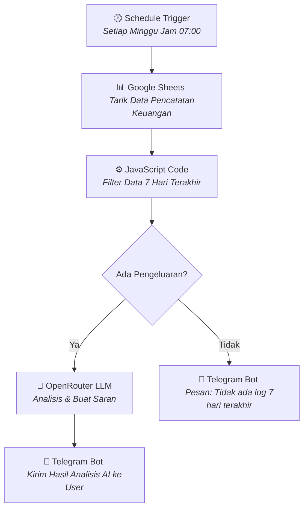

  <h1>🤖 AI-Driven Weekly Expense Report Workflow</h1>
  
<em>Sistem Otomatisasi Laporan Keuangan Mingguan Berbasis AI menggunakan n8n</em>

  
  
  
  
  

---

Halo! Nama saya **Muhammad Aulia Hakim Syahputra**. 

Repositori ini berisi dokumentasi dan *workflow* n8n untuk **Proyek Otomatisasi Laporan Keuangan Mingguan Berbasis AI**. Sistem ini dirancang untuk menarik data pengeluaran dari Google Sheets, memfilternya secara otomatis, lalu menggunakan Kecerdasan Buatan (LLM) untuk menganalisis kebiasaan belanja dan memberikan saran penghematan langsung ke Telegram Anda setiap minggu.

## 📑 Daftar Isi
- [✨ Fitur Utama](#-fitur-utama)
- [🔄 Alur Kerja (Workflow)](#-alur-kerja-workflow)
- [🛠️ Alat & Teknologi](#️-alat--teknologi)
- [📂 Struktur Repository](#-struktur-repository)
- [🚀 Cara Instalasi & Penggunaan](#-cara-instalasi--penggunaan)

---

## ✨ Fitur Utama

- 🕒 **Automated Trigger**: Berjalan otomatis seminggu sekali (berbasis jadwal). Tidak perlu repot mengecek secara manual.
- 🔍 **Data Filtering Cerdas**: Dilengkapi dengan *script* khusus (JavaScript) untuk mem-parsing dan menyaring transaksi tepat hanya pada 7 hari terakhir.
- 🧠 **AI Financial Advisor**: LLM (melalui OpenRouter) menganalisis pola belanja Anda minggu ini dan merumuskan **1 saran penghematan** yang paling relevan dan praktis.
- 📱 **Instant Notification**: Tidak perlu membuka aplikasi keuangan kompleks, hasil ringkasan dan analisis AI akan dikirimkan langsung ke aplikasi Telegram Anda.

---

## 🔄 Alur Kerja (Workflow)

Berikut adalah bagaimana sistem ini bekerja dari awal hingga akhir:

---

## 🛠️ Alat & Teknologi

| Alat | Fungsi |
|---|---|
| **[n8n](https://n8n.io/)** | Platform *workflow automation* utama yang merangkai semua integrasi. |
| **[Google Sheets](https://google.com/sheets)** | Bertindak sebagai *database* tempat pengeluaran dicatat sehari-hari. |
| **[OpenRouter](https://openrouter.ai/)** | API untuk mengakses berbagai model *Large Language Models* (LLM). Sistem ini menggunakan model `openai/gpt-oss-120b:free`. |
| **[Telegram](https://telegram.org/)** | Bot yang berfungsi sebagai media pengiriman *output* langsung ke gawai pengguna. |

---

## 📂 Struktur Repository

Berikut adalah penjelasan mengenai fungsi dari masing-masing file yang ada di dalam *repository* ini:

1. 📄 **`Workflow Laporan Keuangan Mingguan.json`**
   Ini adalah file inti *workflow* n8n. Anda dapat langsung mengimpor file ini ke dalam platform n8n Anda. File ini sudah berisi semua konfigurasi node mulai dari *Trigger*, *Google Sheets*, *Code*, percabangan *If*, integrasi *LLM*, hingga ke *Telegram Bot*.

2. 📜 **`Code in JavaScript`**
   File *source code* terpisah untuk memudahkan Anda meninjau *script* JavaScript yang ada di dalam *Code Node*. *Script* ini bertugas menghitung tanggal mundur 7 hari, mem-parsing format tanggal Google Sheets, menyaring data, dan menyusunnya menjadi format teks yang rapi untuk dianalisis oleh AI.

3. 📊 **`1Data Dummy Catatan Keuangan.xlsx`**
   Merupakan contoh format data atau *template* kolom yang harus ada di *Google Sheets* Anda (Tanggal, Deskripsi, Jumlah/IDR, dll.). Jadikan file ini sebagai panduan struktur *database* Anda.

---

## 🚀 Cara Instalasi & Penggunaan

Untuk menjalankan sistem ini di lingkungan n8n Anda sendiri, ikuti langkah-langkah berikut:

1. **Siapkan Database**: Buat *spreadsheet* baru di Google Sheets. Anda bisa menggunakan format kolom yang ada di file `1Data Dummy Catatan Keuangan.xlsx`.
2. **Import Workflow**: Buka n8n Anda, pergi ke bagian *Workflows*, klik `Import from File`, lalu pilih file `Workflow Laporan Keuangan Mingguan.json`.
3. **Konfigurasi Kredensial (Credentials)**:
   - Hubungkan akun Google Sheets Anda.
   - Masukkan API Key dari OpenRouter di node *OpenRouter Chat Model*.
   - Masukkan token Telegram Bot Anda beserta Chat ID Anda di node Telegram.
4. **Aktifkan Workflow**: Ubah status *workflow* menjadi **Active** agar otomatis berjalan sesuai jadwal yang ditentukan (setiap minggu jam 07:00).
5. **Uji Coba**: Anda bisa menekan tombol **Test Workflow** untuk memastikan data terkirim dengan benar ke Telegram Anda.
